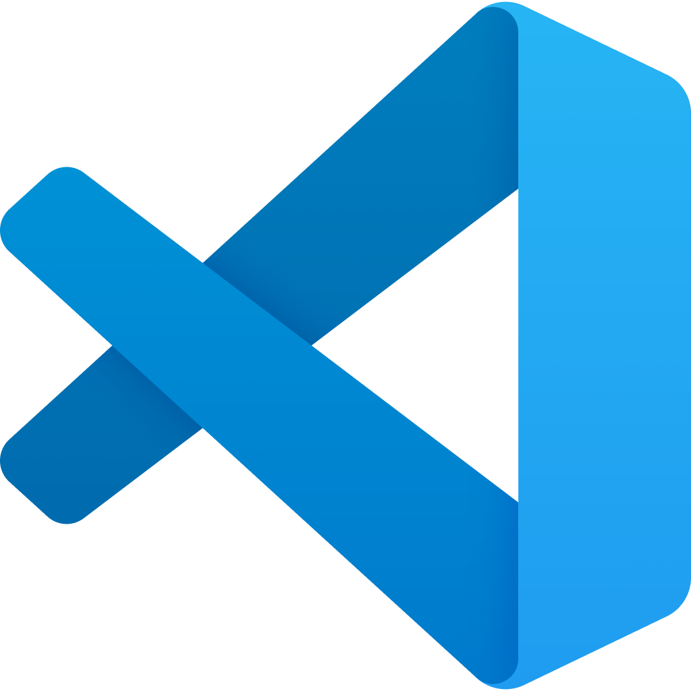

#  VS Code CheatSheet

😍 Welcome to the **VS Code Mastery** repository! This is a helpful guide for VS Code shortcuts and tips.

## 📋 Table of Contents

- [Getting Started](#getting-started)
- [Contributing](#contributing)
- [License](#license)

## ➡️ Getting Started

This **Cheat Sheet** contains useful information about Visual Studio Code features and keyboard shortcuts. Navigate to [**vs-code.md**](https://github.com/genze121/VS-Code-Cheatsheet/blob/master/vs-code.md "VS Code Tips & Tricks") for expert VS Code shortcuts and productivity workflows.

## 👾 Contributing

Feel free to contribute to this **Cheat Sheet** by submitting pull requests with improvements or additional shortcuts.

## 💌 License

This project is open source and available under the MIT License.
